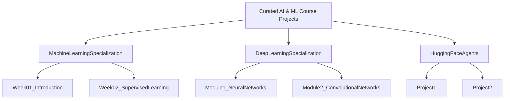

# 🚀 Curated AI & ML Course Projects

> A handpicked collection of projects, assignments, and experiments from various AI and ML courses—including Machine Learning Specialization, Deep Learning Specialization, and Hugging Face Agents. Explore structured, hands-on learning and discover the evolution of cutting-edge AI techniques!

[](https://python.org)
[](https://jupyter.org)
[](LICENSE)
[](https://github.com/YourUsername/curated-ai-ml-course-projects/issues)

---

## 📚 Table of Contents

- [✨ Features](#-features)
- [📁 Repository Structure](#-repository-structure)
- [🛠️ Technology Stack](#️-technology-stack)
- [🚀 Getting Started](#-getting-started)
- [📚 How to Reference](#-how-to-reference)
- [🤝 Contributing](#-contributing)
- [📝 License](#-license)
- [👨‍💻 Author](#-author)

---

## ✨ Features

- **Organized Learning:** Structured directories for each course and module.
- **Comprehensive Documentation:** Detailed READMEs and in-code comments for every project.
- **Interactive Examples:** Jupyter notebooks and scripts for hands-on learning.
- **Diverse Projects:** From foundational ML assignments to advanced deep learning experiments.
- **Continuous Growth:** Regular updates as new courses and experiments are added.

---

## 📁 Repository Structure

Below is an overview of the repository structure to help you navigate the content easily:



Each top-level folder represents a course or specialization, with subdirectories for individual weeks, modules, or projects. Detailed documentation within each folder will guide you through the learning objectives and code implementations.

---

## 🛠️ Technology Stack

This repository leverages a variety of tools and frameworks that power modern AI and ML workflows:

- **Programming:** Python
- **Interactive Coding:** Jupyter Notebooks
- **Machine Learning Libraries:** scikit-learn, TensorFlow, PyTorch
- **Data Manipulation:** NumPy, pandas
- **Visualization:** Matplotlib, Seaborn, Plotly
- **Version Control:** Git & GitHub

---

## 🚀 Getting Started

### Prerequisites

Make sure you have the following installed on your system (Preferred Python 3.11):

- [Python 3.9+](https://www.python.org/downloads/)
- [Jupyter Notebook](https://jupyter.org/install)
- Git

### Installation

1. **Clone the Repository:**

   ```bash
   git clone https://github.com/BjornMelin/curated-ai-ml-course-projects.git
   cd curated-ai-ml-course-projects
   ```

2. **Create and Activate a Virtual Environment:**

   ```bash
   python -m venv env
   source env/bin/activate  # On Windows use `env\Scripts\activate`
   ```

3. **Install Dependencies:**

   ```bash
   pip install -r requirements.txt
   ```

4. **Launch a Jupyter Notebook:**

   ```bash
   jupyter notebook
   ```

Explore the course directories and open the notebooks to start experimenting with the code and concepts.

---

## 📚 How to Reference

If you find this repository useful for your research or projects, please consider citing it:

```bibtex
@misc{BjornMelin2025CuratedAIML,
  author       = {Bjorn Melin},
  title        = {Curated AI \& ML Course Projects},
  year         = {2025},
  publisher    = {GitHub},
  url          = {https://github.com/BjornMelin/curated-ai-ml-course-projects},
  note         = {A curated collection of AI and ML projects from various online courses.}
}
```

Standard Citation:

```
Melin, B. (2025). curated-ai-ml-course-projects: Curated AI & ML Course Projects. GitHub. https://github.com/BjornMelin/curated-ai-ml-course-projects
```

---

## 🤝 Contributing

Contributions are welcome! If you'd like to add a project, improve documentation, or suggest changes:

1. Fork the repository.
2. Create your feature branch: `git checkout -b feature/your-feature`
3. Commit your changes: `git commit -am 'Add some feature'`
4. Push to the branch: `git push origin feature/your-feature`
5. Open a pull request.

Please make sure to follow the existing code style and write clear commit messages.

---

## 📝 License

This project is licensed under the [MIT License](LICENSE). Feel free to use, modify, and distribute the code.

---

## 👨‍💻 Author

**Bjorn Melin**  
[GitHub](https://github.com/BjornMelin) • [LinkedIn](https://www.linkedin.com/in/bjorn-melin) • [Website](https://bjornmelin.io)

---

<p align="center">
  Made with ❤️ and ☕ by Bjorn Melin
</p>
