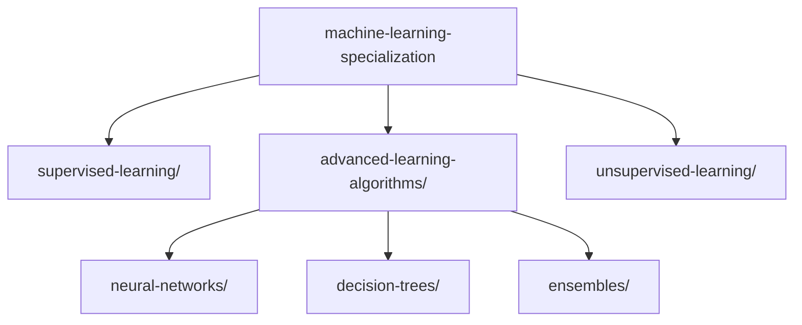

# 🎓 Machine Learning Specialization

> A comprehensive collection of projects, assignments, and experiments from the Machine Learning Specialization course.

## 📚 Table of Contents

- [Overview](#overview)
- [Course Structure](#course-structure)
- [Repository Organization](#repository-organization)
- [Getting Started](#getting-started)
- [Prerequisites](#prerequisites)
- [Contributing](#contributing)
- [License](#license)

## 🌟 Overview

This repository contains my work and implementations from the Machine Learning Specialization course. It serves as both a learning journey documentation and a resource for others studying machine learning concepts.

## 📘 Course Structure

The Machine Learning Specialization consists of three main courses:

1. **Supervised Machine Learning**
   - Regression and Classification
   - Gradient Descent
   - Feature Engineering
2. **[Advanced Learning Algorithms](./advanced-learning-algorithms)**
   - [Neural Networks](./advanced-learning-algorithms/neural-networks)
   - Decision Trees
   - Tree Ensembles
3. **Unsupervised Learning**
   - Clustering
   - Dimensionality Reduction
   - Anomaly Detection

## 📁 Repository Organization



Each course directory contains:

- 📓 Jupyter notebooks with implementations and experiments
- 📝 Programming assignments and solutions
- 📊 Datasets and resources
- 📖 Documentation and notes

## 🚀 Getting Started

1. Clone the repository:

```bash
git clone https://github.com/YourUsername/curated-ai-ml-course-projects.git
cd curated-ai-ml-course-projects/machine-learning-specialization
```

2. Set up your Python environment:

```bash
python -m venv venv
source venv/bin/activate  # On Windows: venv\Scripts\activate
pip install -r requirements.txt
```

## 🛠 Prerequisites

To work with this repository, you'll need:

- Python 3.8+
- Jupyter Notebook/Lab
- Key libraries:
  ```txt
  numpy>=1.21.0
  pandas>=1.3.0
  scikit-learn>=0.24.0
  tensorflow>=2.8.0
  matplotlib>=3.4.0
  ```

## 🤝 Contributing

Contributions are welcome! To contribute:

1. Fork the repository
2. Create a feature branch
3. Commit your changes
4. Push to the branch
5. Open a Pull Request

Please ensure your contributions:

- Follow the repository's structure
- Include clear documentation
- Maintain consistent code formatting

## 📄 License

This project is licensed under the MIT License - see the [LICENSE](../LICENSE) file for details.

---

⭐ If you find this repository helpful, please consider giving it a star!
