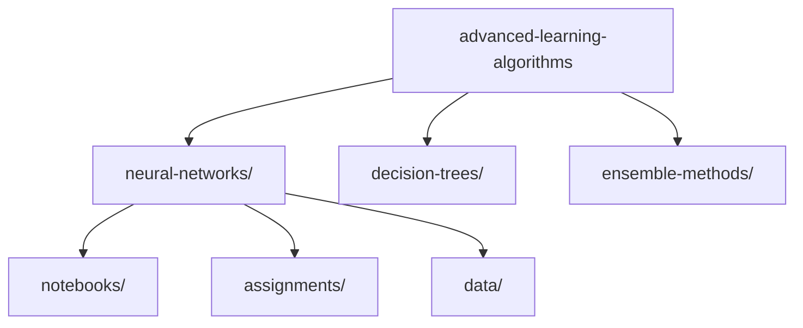

# 🧮 Advanced Learning Algorithms

> Explore sophisticated machine learning algorithms and their implementations in this second course of the Machine Learning Specialization.

## 📚 Table of Contents

- [Overview](#overview)
- [Course Content](#course-content)
- [Directory Structure](#directory-structure)
- [Study Guide](#study-guide)
- [Resources](#resources)
- [Prerequisites](#prerequisites)
- [Contributing](#contributing)
- [License](#license)

## 🌟 Overview

This directory contains materials from the "Advanced Learning Algorithms" course, focusing on neural networks, decision trees, and ensemble methods. The course builds upon fundamental machine learning concepts to explore more sophisticated algorithms and their practical applications.

## 📘 Course Content

### Major Topics

1. **[Neural Networks](./neural-networks)**
   - Neural Network Architecture
   - Forward and Backward Propagation
   - Activation Functions
   - Training and Optimization
2. **Decision Trees** (Coming Soon)
   - Tree Construction
   - Information Gain
   - Pruning Techniques
3. **Ensemble Methods** (Coming Soon)
   - Random Forests
   - Gradient Boosting
   - Model Combination Strategies

## 📁 Directory Structure



## 📖 Study Guide

1. **Week 1-2: Neural Networks**
   - Start with the [Neural Networks](./neural-networks) section
   - Complete practical implementations
   - Study activation functions and their effects
2. **Week 3: Decision Trees**
   - Understanding tree-based algorithms
   - Implementing decision trees from scratch
   - Optimization techniques
3. **Week 4: Ensemble Methods**
   - Combining multiple models
   - Random forest implementations
   - Gradient boosting techniques

## 📚 Resources

- 📓 Jupyter notebooks with detailed explanations
- 💻 Programming assignments with starter code
- 📊 Datasets for hands-on practice
- 📝 Implementation tips and best practices

## 🛠 Prerequisites

Before starting this course, ensure you have:

```bash
# Required Software
Python 3.8+
Jupyter Notebook/Lab

# Key Libraries
numpy>=1.21.0
tensorflow>=2.8.0
scikit-learn>=0.24.0
matplotlib>=3.4.0
pandas>=1.3.0
```

## 🤝 Contributing

Contributions to improve the course materials are welcome:

1. Fork the repository
2. Create your feature branch
3. Commit your changes
4. Push to the branch
5. Open a Pull Request

Please ensure your contributions:

- Follow existing documentation style
- Include clear comments
- Provide practical examples where possible

## 📄 License

This project is licensed under the MIT License - see the [LICENSE](../../LICENSE) file for details.

---

📚 Return to [Machine Learning Specialization](../)
