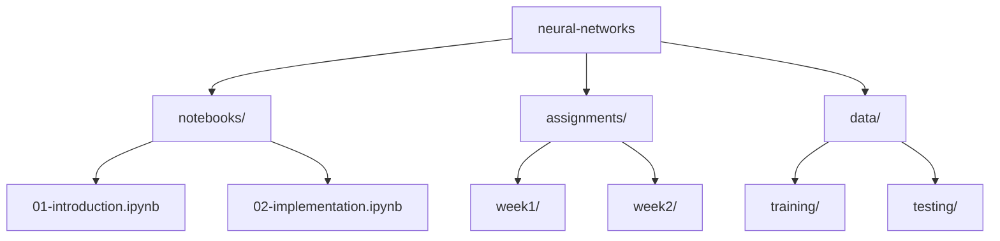

# 🧠 Neural Networks - Advanced Learning Algorithms

> Discover the fundamentals and advanced concepts of neural networks through hands-on implementations and practical examples.

## 📚 Table of Contents

- [Overview](#overview)
- [Folder Structure](#folder-structure)
- [Prerequisites](#prerequisites)
- [Getting Started](#getting-started)
- [Usage](#usage)
- [How to Reference](#how-to-reference)
- [Contributing](#contributing)
- [License](#license)

## 🌟 Overview

This section is part of the Machine Learning Specialization's Advanced Learning Algorithms course. Here, we dive deep into neural network architectures, training methodologies, and evaluation techniques. Through a combination of theoretical understanding and practical implementations, you'll learn how to:

- Design and implement neural networks from scratch
- Understand activation functions and their impact
- Master forward and backward propagation
- Optimize neural network performance
- Apply neural networks to real-world problems

## 📁 Folder Structure



- 📓 `notebooks/`: Interactive Jupyter notebooks covering core concepts
- 📝 `assignments/`: Weekly programming assignments and exercises
- 📊 `data/`: Dataset files used in notebooks and assignments

## 🚀 Prerequisites

Before starting with the neural networks section, ensure you have the following installed:

```bash
# Required Software
Python 3.8+
Jupyter Notebook or JupyterLab

# Key Libraries
numpy>=1.21.0
tensorflow>=2.8.0
matplotlib>=3.4.0
pandas>=1.3.0
scikit-learn>=0.24.0
```

## 🎯 Getting Started

1. Clone the repository:

```bash
git clone https://github.com/YourUsername/curated-ai-ml-course-projects.git
cd curated-ai-ml-course-projects/machine-learning-specialization/advanced-learning-algorithms/neural-networks
```

2. Set up a virtual environment:

```bash
python -m venv venv
source venv/bin/activate  # On Windows: venv\Scripts\activate
pip install -r requirements.txt
```

3. Launch Jupyter:

```bash
jupyter notebook
```

## 💡 Usage

The content is organized sequentially, recommended to be followed in order:

1. Start with the introductory notebooks in `notebooks/` to understand core concepts
2. Complete the weekly assignments in `assignments/` to reinforce learning
3. Experiment with the provided datasets in `data/` for hands-on practice

Example notebook usage:

```python
# Import common libraries
import numpy as np
import tensorflow as tf
import matplotlib.pyplot as plt

# Load helper functions
from utils import plot_decision_boundary

# Create a simple neural network
model = tf.keras.Sequential([
    tf.keras.layers.Dense(units=25, activation='relu'),
    tf.keras.layers.Dense(units=1, activation='sigmoid')
])
```

## 📖 How to Reference

If you use this content in your work, please cite:

```bibtex
@misc{YourName2025NeuralNetworks,
    author       = {Your Name},
    title        = {curated-ai-ml-course-projects: Neural Networks - Advanced Learning Algorithms},
    year         = {2025},
    publisher    = {GitHub},
    url          = {https://github.com/YourUsername/curated-ai-ml-course-projects},
    note         = {A curated collection of neural network experiments from the Machine Learning Specialization course.}
}
```

Or in text format:

Your Name. (2025). curated-ai-ml-course-projects: Neural Networks - Advanced Learning Algorithms [Computer software]. GitHub. https://github.com/YourUsername/curated-ai-ml-course-projects

## 🤝 Contributing

Contributions are welcome! To contribute:

1. Fork the repository
2. Create a feature branch (`git checkout -b feature/AmazingFeature`)
3. Commit your changes (`git commit -m 'Add some AmazingFeature'`)
4. Push to the branch (`git push origin feature/AmazingFeature`)
5. Open a Pull Request

Please ensure your contributions follow:

- Clear documentation standards
- Consistent code formatting
- Comprehensive test coverage where applicable

## 📄 License

This project is licensed under the MIT License - see the [LICENSE](../../../LICENSE) file for details.
